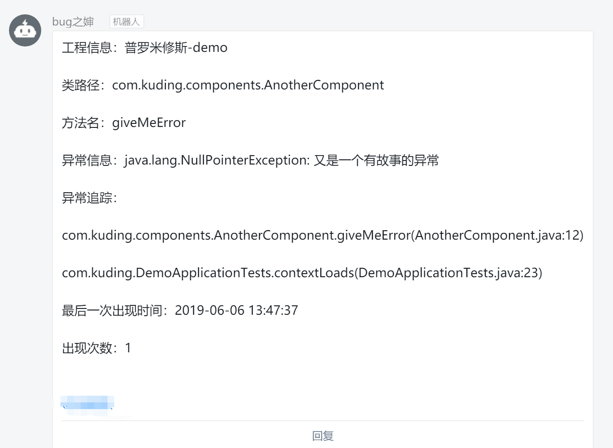
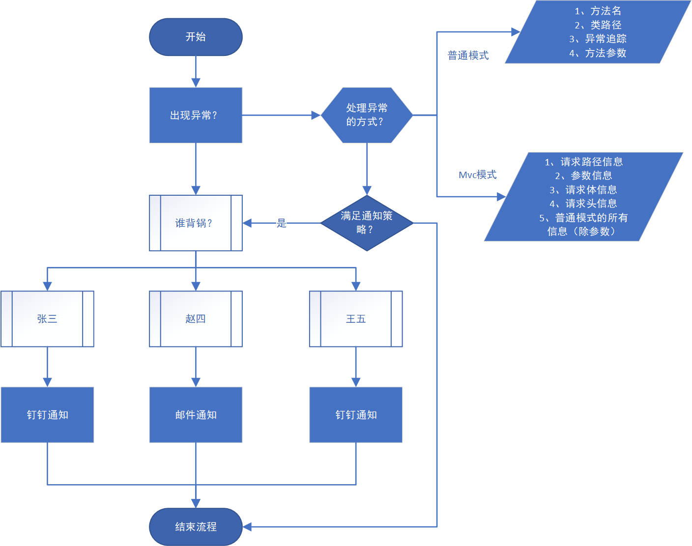
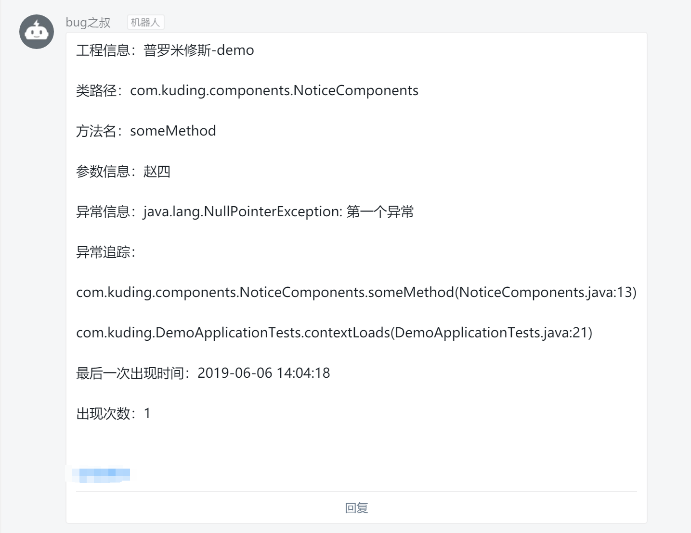
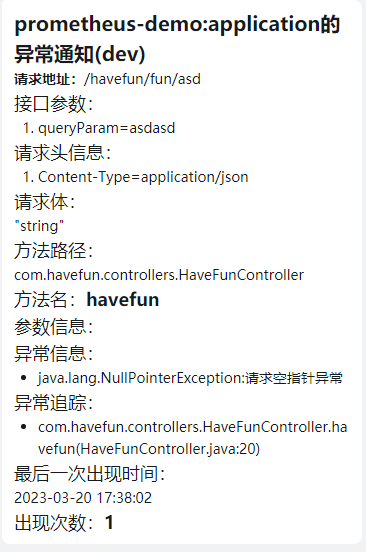
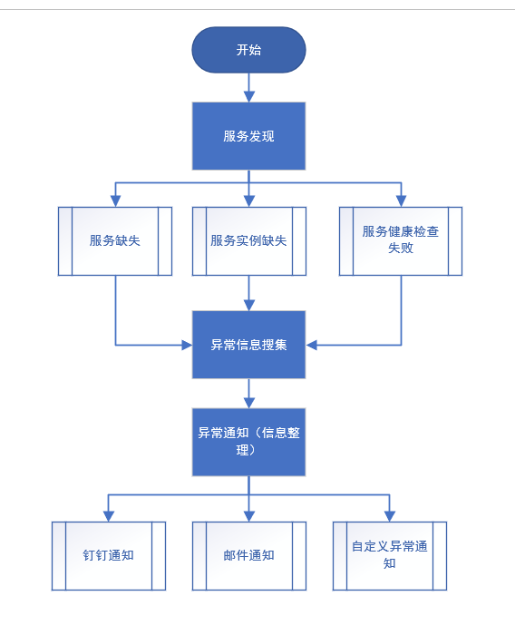
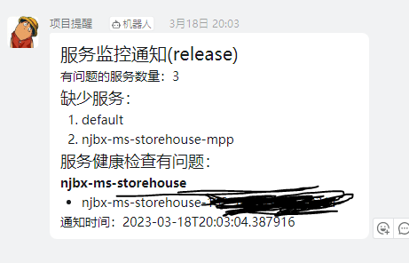

# 一个异常通知的spring-boot-start框架 exceptionmessageteam-spring-boot-starter


## 前言

1. 对于工程的开发，必然会伴随着各种bug，工程量越大，出现bug的概率也会越高。一般对于代码量较小的工程来说，一个人可能就足够去做开发与维护；但是对于代码量较大的工程往往是需要一个小团队协作开发。当工程基本完成，开始部署测试环境或者生产环境时，这些环境并不能像开发环境一样能快速的调试与维护，线上的工程一旦出现异常时，开发团队就需要主动感知异常并协调处理，当然人不能一天24小时去盯着线上工程，所以就需要一种机制来自动化的对异常进行通知，并精确到谁负责的那块代码。这样会极大地方便后续的运维。因此，本项目上线
2. 目前版本只支持springboot3，不再兼容springboot3以下的版本,**需要看springboot2版本的可以看0.8.0以前的分支**
3. 从此版本开始，后续的所有版本将会上传至maven中央仓库

## 系统需求

  

## 当前版本


## 系统介绍

- 目前整个系统分为两大模块
1. 异常通知模块：主要用于处理在项目中曝出的未捕获异常，通过钉钉或者邮件等方式进行主动消息通知
2. 微服务通知模块：主要用于对微服务集群中服务信息异常、缺失等情况，通过钉钉或邮件等方式进行消息通知


## 异常通知


### 最快上手

- 将此工程通过``mvn clean install``打包到本地仓库中。(目前0.8.0版本已加入maven中央仓库，可以直接进行依赖即可)

- 在你的工程中的``pom.xml``中做如下依赖

```xml

<dependency>
    <groupId>com.github.yanceking</groupId>
    <artifactId>exceptionmessageteam-spring-boot-starter</artifactId>
    <version>1.1.1-team</version>
</dependency>
```

- 在``application.properties``或者``application.yml``中做如下的配置：（至于以上的配置说明后面的章节会讲到）

```yaml
prometheus:
  enabled: true
  exceptionnotice:
    enabled: true
    included-trace-package: com.havefun
  notice:
    dingding:
      user1:
        access-token: 在webhook中的参数：accessToken
        sign-secret: 钉钉的签名秘钥
        enable-signature-check: true
        phone-num: 
        - 通知人的手机号
  default-name: user1
```

- 至于钉钉的配置请移步：[钉钉机器人](https://open-doc.dingtalk.com/microapp/serverapi2/krgddi "自定义机器人")，这里需要特别说明一下，钉钉在2019年10月份（大概）对于钉钉机器人进行了一次改进,这次改进主要是安全设置变为必选项，原来已经配置过的钉钉机器人且没有配置安全设置的不受影响

- 以上配置好以后就可以写demo测试啦，首先创建第一个bean：

```java
@Component
@ExceptionListener
public class SomeComponent {
	public String haveException() {
		throw new NullPointerException("这是个空指针异常");
	}
}
```

- 以上都建立好了以后，就可以写单元测试了:
```java
@SpringBootTest
class PrometheusDemoApplicationTests {

	@Autowired
	private SomeComponent someComponent;

	@Test
	void contextLoads() {
		someComponent.haveException();
	}
}

```

当运行单元测试后，假如钉钉配置没有问题的话，你的钉钉中就会出现如下类似的消息：



假如在你配置的钉钉中出现类似这个信息的化，恭喜你，你成功的产生了一个异常通知。
- 综上，一个最简单的例子就完成了。

### 咋做的

本框架遵循spring boot starter的自动化配置规范而开发的自动化异常通知框架，整体业务流程如下：



### 配置

本框架配置主要分为4部分：

1. 全局配置
2. 异常配置
3. 通知配置
4. 外援配置

#### 全局配置

- 全局配置有：

```yaml
prometheus:
  enabled: true
  project-enviroment: develop
  project-name: demo
  default-name: user1
```
具体说明如下：

|名称|参数类型|说明|必要配置|
|:-:|:-:|:-:|:-:|
|enabled|boolean|用于开启项目配置，属于总控开关|是|
|project-enviroment|enum|工程环境（enum），默认为develop|否|
|project-name|string|一般忽略，以spring.application.name替代|否|
|default-name|string|表示默认通知人|是|

- ``project-enviroment``主要用于区分线上异常通知的环境问题，对于日常开发到测试部署到正式部署，配置信息不管通过传统的工程内properties控制还是通过微服务配置中心统一配置，都需要区别工程环境的问题，所以为了方便对比，加入了此配置项

- 工程所处环境分了如下几个：
    - develop：开发环境
    - test：测试环境
    - preview：预部署环境
    - release：正式环境
    - rollback:回滚环境
      以上5种环境基本够用。


- 异常配置分为两块，分别为异常通知配置与通知频率策略配置，具体如下配置（yml）

```yaml
prometheus:
  exceptionnotice:
    enabled: true
    listen-type: common
    included-trace-package: com.havefun
    strategy:
      frequency-type: showcount
      notice-show-count: 3
    include-header-name:
    - headParam
    - host
    exclude-exceptions:
    - some.your.excetion
```

|名称|参数类型|说明|必要配置|
|:-:|:-:|:-:|:-:|
|enabled|boolean|基本不用，默认为true，用于开启异常通知配置|否|
|included-trace-package|string|异常追踪的包路径，一般情况下，此配置项就是配置你工程的包路径就可以了|是|
|listen-type|enum|监听类型，有两种：**common/web**，默认为common|是|
|exclude-exceptions|list|排除异常，表示若出现这些异常不需要进行异常通知|否|
|include-header-name|list|异常通知中需要包含的header信息(不写全部返回)|否|
|策略配置|
|frequency-type|enum|通知频率策略类型：showcount/timeout ， 默认是timeout|否|
|notice-show-count|int|当策略类型为showcount时，表示距上次通知再出钱多少次需要再次通知|否|
|notice-time-interval|duration|当策略类型为timeout是，表示距上次通知经过多长时间后再次通知 ， 默认8小时|否|

- 以上通知中**最重要**的当属``exceptionnotice.listen-type``,此配置表示工程的监听方式，目前有两种监听方式：**普通监听（common）** ；**web监听（web）** 。这两种监听方式各有千秋，普通监听方式主要运用aop的方式对有注解的方法或类进行监听，可以加在任何类与方法上。**web监听只能对controller层进行监听，对其它层无效**，不过异常通知的信息更丰富，不仅仅包括了普通监听的所有信息（不包含参数），还包含了请求中的路径信息（path）、参数信息（param）、请求中的请求体信息（body）和请求体中的头信息（header）。例如：


```java

@RestController
@RequestMapping("/havefun")
@ExceptionListener
public class HaveFunController {

	@PostMapping("/fun/{pathVal}")
	public String havefun(@PathVariable String pathVal, @RequestParam String queryParam,
			@RequestBody String bodyParam) {
		throw new NullPointerException("请求空指针异常");
	}
}


```
具体效果如下：



- 项目中的异常一般分类两大类：第一类为未捕获异常，第二类为业务异常。业务异常一般由用户自己定义的异常，在javaweb项目中，假如用户的请求不满足返回结果的条件，一般是需要主动抛出自定义异常的，所以这类异常并不需要进行通知。排除不需要异常通知的配置如下：
```
 prometheus.exceptionnotice.exclude-exceptions=java.lang.IllegalArgumentException,com.yourpackage.YourLogicException
```
- 一般而言，一个方法出现异常信息，意味着每当同样的方式进行调用时都会抛出相同的异常方法，放任不管的话，钉钉异常通知与邮件异常通知会重复的收到同一个异常，所以为了限制发送频率，默认情况下，某个方法出现的异常需要通知，那么这条通知**每天只会出现一次**。当然这样也可能会出现问题，假如邮件或钉钉信息没有收到，很可能会漏掉此通知，所以这里创造了一个通知的策略。

- 通知策略对应的配置类为``ExceptionNoticeFrequencyStrategy``

- 目前一共有两种通知策略
    - 时间策略
    - 出现频次策略

对应的配置为：
```
exceptionnotice.strategy.frequency-type=timeout/showcount
```
- 时间策略对应的配置项为``exceptionnotice.strategy.notice-time-interval``，类型为duration，表示的是自上次通知时间起，超过了此配置的时间后，便会再次通知。
- 频次策略对应的配置项为``exceptionnotice.strategy.notice-show-count``，表示的是自上次通知起，出现次数超过了此配置测次数后，便会再次通知，基本上以上策略足够使用，假如说还有更好的配置策略可以连系我
- 假如什么都不配置的情况下，默认的的通知频率策略为8小时间隔

#### 通知配置


- 上面说了全局配置与异常配置，当项目获取异常以后，经过消息封装，后面需要做的就是进行通知了

- 通知配置一共三总类型：
    1. 钉钉通知
    2. 邮件通知
    3. 自定义通知

- 下面是所有通知配置

```yaml
prometheus:
  notice:   
    enable-async: true
    dingding-text-type: text
    email-text-type: text
    dingding:
      user1:
        access-token: 钉钉webhook中的token参数
        enable-signature-check: true
        phone-num: 
        - 通知人手机号
        sign-secret: 签名秘钥
    email:
      user2: 
        to: 发给谁
        bcc: 秘密抄送给谁
        cc: 抄送给谁

```

|名称|参数类型|说明|必要配置|
|:-:|:-:|:-:|:-:|
|enable-async|boolean|是否开启异步通知，默认不开启|否|
|dingding-text-type|enum|钉钉通知的文本类型：text/markdown，默认为text|否|
|email-text-type|enum|email的通知文本格式，目前只有text|否|
|dingding|map|钉钉通知人信息，key表示的通知人标识，value为钉钉相关配置|是|
|email|map|邮件通知人, key标志的是通知人标识，value为邮件相关配置|否|
|钉钉相关配置|
|access-token|string|钉钉的webhook中带的token值|是|
|enable-signature-check|boolean|是否开启签名验证，默认为是|否|
|phone-num|string|通知的手机号|是|
|sign-secret|string|签名秘钥，当enable-signature-check为true时必填|是|
|相关配置|
|to|string|通知人的邮箱|是|
|cc|string|抄送邮箱|否|
|bcc|string|秘密抄送邮箱|否|


- 以上就是全部的通知配置，这里需要说明的是钉钉的通知配置与email的通知配置可以对应同一个人，表示的是需要通知时，同时会向此人配置的钉钉与邮箱发送消息

- 开启签名验证时，需要在钉钉机器人的安全设置中选中**加签**设置：

- 框架内保留了通知所需的所有的接口，使用者可以自行定义自己的通知方式，详情请先往下看，后面有介绍


- 可以看以下的配置
```yaml
prometheus:
  enabled: true
  default-name: user1
  exceptionnotice:
    enabled: true
    included-trace-package: 你自己的包路径
    listen-type: web
    include-header-name:
    - Content-Type
  notice:
    dingding:
      user1: 
        access-token: 
        sign-secret: 你自己
        phone-num: 手机号
    dingding-text-type: markdown
```
以上配置使用了web模式，同时过滤了请求中的header，出现异常时，通过钉钉通知，钉钉通知显示的是**markdown**格式：



相对于字符串拼接，markdown结构性会相对的强一些

#### 外援配置


- 有邮件通知的话需要在``pom.xml``中加入如下依赖

```xml
<dependency>
	<groupId>org.springframework.boot</groupId>
	<artifactId>spring-boot-starter-mail</artifactId>
</dependency>
```

加入依赖后开始配置邮件信息

```yaml
spring:
  mail:
    host: smtp.xxx.com
    port: 25
    username: 开启smtp权限的邮箱用户名
    password: 密码
    properties:
      '[mail.smtp.ssl.enable]': true #开启ssl时进行配置
      
      
```

- 开启web模式的话，不说也知道，一定会引入如下依赖：

```xml
		<dependency>
			<groupId>org.springframework.boot</groupId>
			<artifactId>spring-boot-starter-web</artifactId>
		</dependency>
```


### 注解

```java
@Documented
@Retention(RetentionPolicy.RUNTIME)
@Target({ ElementType.METHOD, ElementType.TYPE })
public @interface ExceptionListener {

	/**
	 * 出错了找谁？？？
	 * 
	 * @return
	 */
	String value() default "";
}

```

- 上面讲的配置实际上是为此注解服务的，框架内唯一的注解``@ExceptionListener``，需要注意的是，凡是你需要异常通知的类或方法上必须加此注解。
- 根据配置类型``exceptionnotice.listen-type``的不同配置注解的位置也是不一样的
    - ``exceptionnotice.listen-type=common``时``@ExceptionListener``可以加到**任意类上，任意方法上**
    - ``exceptionnotice.listen-type=web``时，``@ExceptionListener``只能加在Controller层即带有``@Controller``或``@RestController``的类或者方法上，方法上也需要有对应的``@RequestMapping``相关的注解
- 对于注解参数表示的是通知配置中需要通知到的人员的标识也就是钉钉或email配置中的key


### 自定义Config

- 目前在上面所有的配置的基础上，本框架还加入了更多的扩展配置，主要包含以下几个模块：
    1. 自定义的消息通知组件
    2. 自定义的异常通知文本结构
    3. 自定义的http组件

- 自定义消息组件主要由接口``INoticeSendComponent``进行消息发送:

```java
public interface INoticeSendComponent extends Unique {

	void send(PromethuesNotice exceptionNotice, NoticeTextResolver noticeTextResolver);

}
```

```java
public interface Unique {

	public String name();
}
```

- ``INoticeSendComponent``是通知的基础接口，钉钉通知``DingDingNoticeSendComponent``与邮件通知``EmailNoticeSendComponent``都继承于此接口。其中``PromethuesNotice``是基础通知信息，目前框架内定义的子类有两种：
    - ``ExceptionNotice``代表着异常通知信息的基础结构
    - ``ServiceCheckNotice``代表着微服务检查通知的基础结构

- 这里通过``Unique``接口来区分每个通知组件的唯一性，例如钉钉通知``DingDingNoticeSendComponent``对应的名称为``dingding``，邮件通知中对应的名称为``email``，这样做的目的是可以让使用者去替换我本来默认的钉钉通知或邮件通知，具体做法就是通过实现``NoticeTextResolverCustomer``接口进行：

```java
public interface NoticeSendComponentCustomer extends Ordered {

	void custom(NoticeSendComponentRegister register);
}
```

- ``NoticeSendComponentRegister``主要用来注册通知组件与这个组件属于谁，这样就可以通过注解``@ExceptionListener``中对应参数找到其对应的通知组件（列表）,从而进行通知了。


- 除了通知组件以外，文本格式处理也是通知模块中一个必要的模块，在工程中搜集到的信息会封装成``PromethuesNotice``的实体，处理这类实体并进行文本格式化是通过下面的接口实现的：

```java
public interface NoticeTextResolver {

	public String resolve(PromethuesNotice notice);

	public boolean support(Class<? extends PromethuesNotice> clazz, INoticeSendComponent sendComponent);
}

```

- 在配置中``dingding-text-type``就有对应的不同的resolver，例如markdown处理``ExceptionNoticeMarkdownMessageResolver``,此类resolver也可以通过编程的形式进行自定义，通过集成``NoticeTextResolverCustomer``来实现

```java
public interface NoticeTextResolverCustomer extends Ordered{

	public void custom(NoticeTextResolverProvider resolverProvider);

}

```

- 钉钉发送目前框架内已改成openfeign来进行发送了（原生的，没有用spring封装的），假如有特殊需求，可以通过实现``DingdingHttpClient``自行处理，这将会覆盖默认的feign模式

```java
@FunctionalInterface
public interface DingdingHttpClient {

	DingDingResult doSend(DingDingNotice notice, DingDingNoticeProperty dingDingNoticeProperty);

}

```

## 微服务监控通知

### 前言

因为我目前用的是社区版的consul注册中心，所以对于微服务的治理consul还可以过得去，问题在于加入说微服务在运行的过程中出现致命错误（堆栈溢出、服务中断等）或者连接的组件（数据库、mq等）出现问题时，作为我来说很难感知到。当然，微服务治理做的比较好的是需要花钱的（例如阿里云的EDAS）。因为有钉钉或者其他通知的接口，所以把微服务治理中服务的异常通知这一块就放在了这个工程中，同时把目前现有的功能组件化。这样也大大提高了各个组件间的协调能力。

### 咋做的




一般而言微服务的治理往往需要另外一个微服务来进行处理，这个微服务主要是进行对注册中心中微服务进行手动的相关操作的（例如重启、注销等），所以，微服务监控通知也要在此微服务中导入。启动此服务的第一步会执行一个初始化的过程，先发现现有微服务中心中所有的微服务，结合配置信息，找出三类微服务相关的异常
1. 服务缺失
2. 服务实例数量不够
3. 服务健康检查不通过

将以上三类异常服务信息进行搜集并利用``ServiceNoticeRepository``进行存储。存储下来的异常信息，将通过``ServiceNoticeTask``通知到对应的通知组件上。


### 配置

```yaml
prometheus:
  enabled: true
  project-enviroment: develop
  dingding:
    enabled: true
    phone-num: 15129072758
    access-token: 
    sign-secret: 
    enable-signature-check: true 
  service-monitor:
    auto-discovery: true
    enabled: true
    service-check-notice-interval: 3m
    service-exist-check-interval: 3m
    monitor-services:
      have-fun: 
        service-count: 3
        health-check-url: /actuator/health
        health-check-headers:
          test: 
          - aaa
        check-interval: 2m
        enabled: true
```

以上就是全部的异常通知配置，通知相关配置在上文有讲过，这里说一下``service-monitor``的相关配置：

|名称|参数类型|说明|必要配置|
|:-:|:-:|:-:|:-:|
|enabled|boolean|开启服务监控，默认为否|是|
|auto-discovery|boolean|是否开启自动发现服务，默认为true|否|
|service-check-notice-interval|duration|服务通知的时间间隔，默认是3分钟|否|
|service-exist-check-interval|duration|微服务存在性检查时间间隔，默认为3分钟|否|
|monitor-services|map|监控服务，key为微服务名称，value为``ServiceCheck``的配置信息|否|
|ServiceCheck|
|service-count|number|服务数量，默认为1|否|
|health-check-url|string|健康检查地址，默认为``actuator``的健康检查地址|否|
|health-check-headers|map|健康检查的header信息|否|
|check-interval|duration|健康检查的时间间隔，默认为两分钟|否|

以上就是服务监控的所有配置

- 理论上任何的服务注册中心都能使用，由于本人只使用过consul，所以其他注册中心的测试有需求可以联系我。在微服务集群上需要添加一个加入本框架的服务，此服务主要用来进行监控通知，或者微服务管理等相关操作，加入后，通过``auto-discovery``发现所有现有的服务集群，同时获取健康状态，这时，框架会默认认为**此时的微服务集群是完整的**，假如又有新的服务加入，框架会通过服务发现自动加入到需要监控的服务列表中

- 目前微服务通知需求还在迭代，有需求或者有问题的小伙伴可以留issue

- 至于通知样子，如钉钉显示：




